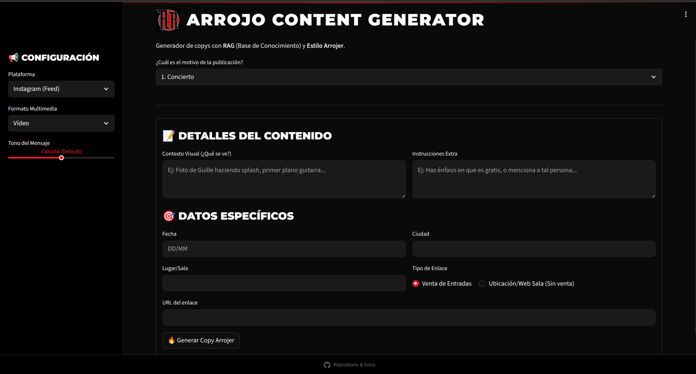

# Arrojo Content Generator (AI Agent) 🤘

[](https://www.python.org/)
[](https://streamlit.io/)
[](https://www.langchain.com/)
[](https://www.docker.com/)

Herramienta interna de IA de vanguardia desarrollada para la banda de rock **Arrojo**. Este agente actúa como Community Manager y Copywriter, generando contenido optimizado con las reglas técnicas específicas para cada red social (Instagram, TikTok, YouTube, WhatsApp) manteniendo una identidad de marca consistente ("Estilo Arrojero").

Utiliza **RAG (Retrieval-Augmented Generation)** para consultar una base de conocimiento vectorial y datos en tiempo real (agenda de conciertos), garantizando que la información generada sea verídica y actualizada.


*(Interfaz construida con Streamlit simulando la estética corporativa de la banda)*

## 🆕 Novedades de la v1.1.0

* **🛡️ Engine de Limpieza de Formato:** Implementación de un filtro de seguridad por Regex que elimina Markdown innecesario en plataformas que no lo soportan (Instagram/TikTok) y gestiona enlaces clicables automáticamente.
* **🎯 Optimización Multi-Plataforma Pro:** Instrucciones dinámicas de optimización basadas en tendencias de 2026:
* **TikTok:** Estrategia de SEO, ganchos de 2 segundos y keywords para OCR.
* **Instagram:** Estructuras para Carruseles educativos y Stickers de interacción en Stories.
* **YouTube:** Guiones con "Loops" para Shorts y marcas de tiempo para vídeos largos.
* **WhatsApp:** Formatización nativa (*negritas* y *cursivas*) para canales.
* **⚡ Arquitectura JSON Estricta:** Migración a `json_mode` para garantizar que la respuesta del LLM sea siempre procesable y libre de errores de sintaxis.

## 🚀 Funcionalidades Clave

* **🧠 Identidad de Marca Persistente:** Prompt del sistema diseñado para adherirse estrictamente al tono de voz de la banda (cercano, rockero, uso específico de emojis).
* **📚 RAG (Retrieval-Augmented Generation):** Consulta en tiempo real a **Qdrant** para integrar biografía, letras y discografía.
* **📅 Agenda Viva:** Ingesta de CSV en vivo (Google Sheets) para consultar fechas de conciertos pasados y futuros.
* **🎨 UI "Stitch" Style:** Interfaz en **Streamlit** con inyección de CSS para replicar el branding oficial de ArrojoRock.es.
* **📱 Multi-Plataforma:** Generación de estructuras JSON específicas para cada red social (hashtags, longitud, formato).

## 🛠️ Stack Tecnológico

* **Frontend:** Streamlit (Python).
* **Orquestación:** LangChain.
* **LLM:** Mistral Creative (vía OpenRouter) para razonamiento complejo en español y con salida estructurada.
* **Vector Store:** Qdrant (Base de datos vectorial alojada localmente).
* **Embeddings:** Qwen3-8B.
* **Seguridad:** Regex-based Content Filtering.

## ⚙️ Configuración

Si quieres clonar y probar este proyecto (necesitarás tus propias API Keys):

1.  **Clonar el repositorio:**
    ```bash
    git clone https://github.com/funkykespain/ContenidoArrojo.git
    cd ContenidoArrojo
    ```

2.  **Crear entorno virtual e instalar dependencias:**
    ```bash
    python -m venv venv
    source venv/bin/activate  # En Windows: venv\Scripts\activate
    pip install -r requirements.txt
    ```

3.  **Configurar variables de entorno:**
    El sistema ahora es más configurable mediante el `.env`. Asegúrate de incluir:

    ```ini
    # Configuración de Modelos
    LLM_MODEL="mistralai/mistral-small-creative"
    EMBEDDING_MODEL="qwen/qwen3-embedding-8b"
    LLM_TEMPERATURE=0.7
    
    # Conectividad Qdrant
    QDRANT_URL="tu-instancia"
    QDRANT_API_KEY="tu-key"
    QDRANT_HTTPS=True
    QDRANT_COLLECTION="arrojo-docs"
    
    # API Keys y Otros
    OPENROUTER_API_KEY="sk-..."
    AGENDA_CONCIERTOS="url-csv-google-sheets"
    
    ```

4.  **Ejecutar:**
    ```bash
    streamlit run app.py
    ```

## 📂 Estructura del Proyecto

```text
├── app.py              # Lógica v1.1.0 (Frontend + Backend LangChain)
├── Dockerfile          # Despliegue optimizado
├── requirements.txt    # Dependencias actualizadas
└── .env                # Variables de entorno

```

## 🛡️ Licencia

Este proyecto es una herramienta interna para [Arrojo](https://arrojorock.es). El código es libre para fines educativos. Rock on! 🎸